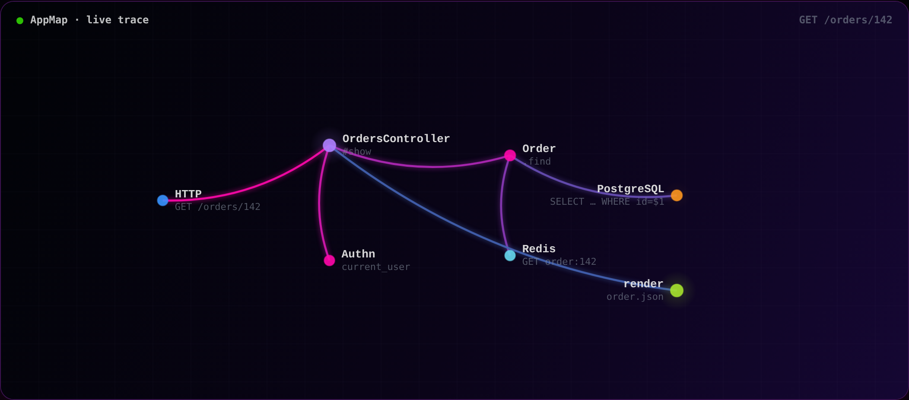

# appmap.io · active visuals

Self-contained, framework-free animated visuals for the AppMap marketing site.
No build step, no dependencies, no runtime AppMap data required — each visual is a
single `<script>` plus a custom element you can drop into any page (or embed via
`<iframe>`).

All visuals use the AppMap brand palette (near-black backgrounds, the signature
pink → purple → blue gradient, the syntax-value accent colors) pulled from
`packages/components/src/scss/_variables.scss`, so they sit naturally alongside the
rest of the site.

## live-trace

An animated AppMap trace: a request flows through the application's call graph —
nodes light up as they become active, glowing particles travel the call edges, and
the edges stay lit with the brand gradient as the trace completes, then the whole
thing fades and loops.



### Embed

```html
<script src="/path/to/appmap-live-trace.js"></script>
<appmap-live-trace></appmap-live-trace>
```

Size it with CSS (the element fills its box):

```html
<div style="width: 100%; max-width: 960px; height: 460px">
  <appmap-live-trace scenario="web"></appmap-live-trace>
</div>
```

### Attributes

| Attribute   | Values                              | Default | Notes                                              |
| ----------- | ----------------------------------- | ------- | -------------------------------------------------- |
| `scenario`  | `web` · `background` · `navie`      | `web`   | Which story the trace tells.                       |
| `speed`     | number                              | `1`     | Playback multiplier (`1.5` = 50% faster).          |
| `static`    | boolean (present/absent)            | absent  | Render the completed trace without animating.      |

### Scenarios

- **web** — `GET /orders/142` through controller → auth → model → cache → Postgres → render.
- **background** — a Sidekiq `ChargeInvoiceJob`: billing → Stripe → Postgres → mailer.
- **navie** — Navie answering "why is `/orders` slow?", surfacing an N+1 from the trace.

### Accessibility & performance

- Honors `prefers-reduced-motion`: renders the completed (static) trace and does not animate.
- Pauses the animation loop while scrolled out of view (`IntersectionObserver`).
- Canvas is rendered at up to 2× DPR for crisp HiDPI output.

### Preview locally

```sh
cd appmap-io-visuals/live-trace
python3 -m http.server 8080   # then open http://localhost:8080
```

`index.html` shows the hero treatment plus all three scenarios side by side.
