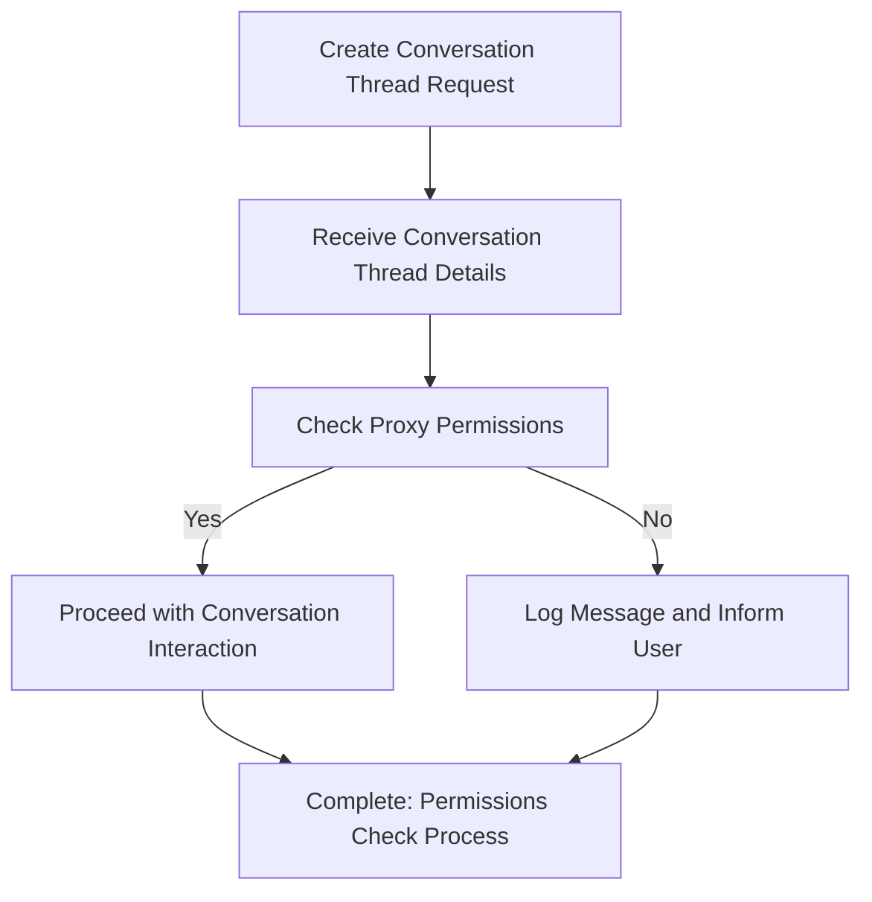

## Check Proxy Permissions

This feature is designed to ensure that proper permissions are adhered to during the conversation
enrollment process. It involves checking the user's access rights to use the Navie AI proxy based on
the organization's policy.

1. **Initiation of the Process**:

   - The sequence begins with a user or system request to initiate a conversation. This serves as
     the starting point, where necessary details for creating a conversation thread are gathered.

2. **Request for Conversation Thread Creation**:

   - The Navie API client formulates a request to create a new conversation thread. This request
     includes relevant model parameters and the project's context to ensure the thread is correctly
     configured.

3. **Receiving Conversation Thread Details**:

   - Once the request is processed by the Navie service, it responds with the conversation thread
     details. This includes information such as permissions, usage metrics, and subs fption data.

4. **Checking of Proxy Permissions**:

   - The system checks the permissions associated with the newly created conversation thread,
     specifically focusing on the use of the Navie AI proxy. This step determines if the
     conversation can proceed according to organizational policies and user entitlements.

5. **Decision on Permission Validity**:

   - At this juncture, the system assesses whether the proxy permissions are valid. If the
     permissions are satisfactory ("Yes" branch), the conversation can continue seamlessly.
   - Conversely, if permissions are inadequate or restricted ("No" branch), a message is logged, and
     the user is informed about the permission issue.

6. **Completion of the Permissions Check Process**:
   - Regardless of the permission outcome, the flow wraps up by completing the permissions check. If
     permissions were valid, the interaction continues smoothly. If not, appropriate actions are
     taken based on the logged messages and informed user feedback.

### Internal Dependencies

1. **Navie API Client**:

   - The client is responsible for sending requests to create conversation threads and receiving
     responses with thread details.

2. **Permissions and Usage Types**:

   - Types such as `Permissions`, `Usage`, and `ConversationThread` are used for handling permission
     checks and usage metrics within the system.

3. **Functions and Services**:

   - Functions like `checkProxyPermissions` are essential for verifying if the user or organization
     is allowed to use the Navie AI proxy feature.

4. **Thread Management**:

   - Components related to managing thread states, including enrolling and interacting with
     conversation threads.

5. **Report and Handle Errors**:
   - Mechanisms to log and inform users about permission-related issues, possibly involving
     functions like `reportFetchError`.

### External Dependencies

1. **AppMap Service**:

   - External service for handling requests related to conversation thread management and enforcing
     organizational policies.

2. **Socket.IO**:

   - Utilized for maintaining real-time communication between the Navie client and service.

3. **Configured Models and APIs**:
   - External models and APIs specified in the configuration, necessary for authenticating and
     authorizing requests made by the client.
