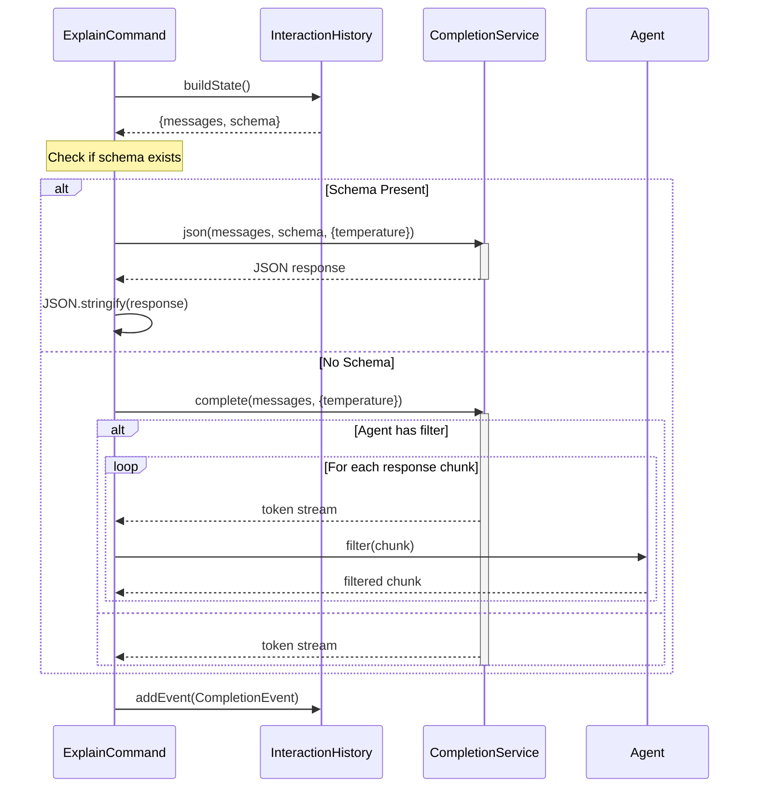

# Structured vs Unstructured Output in Navie

This document describes how an Agent (`src/agents`) can request either structured (JSON) or
unstructured (streaming) output from the language model.

## Overview

When using an Agent, ExplainCommand is responsible for managing the interaction between the user's
request and the language model. It supports two primary modes of operation:

1. Structured JSON output with schema validation
2. Unstructured streaming output with optional filtering

## Sequence Diagram

## Detailed Flow

### 1. Initial State Building

- ExplainCommand begins by requesting the current state from InteractionHistory
- The state includes:
  - Message history (previous interactions)
  - Optional schema for structured output
  - Configuration settings

### 2. Structured Output Path (Schema Present)

When a schema is provided:

- The `CompletionService.json()` method is called with:
  - Current message history
  - Schema definition
  - Temperature setting for response variability
- The response is validated against the schema
- The JSON response is stringified and yielded to the caller
- This path is used for commands that require structured data, such as:
  - Next step predictions
  - Code analysis results
  - Structured metadata

### 3. Unstructured Output Path (No Schema)

When no schema is provided:

- The `CompletionService.complete()` method is used
- Responses are streamed as tokens
- Two sub-paths are possible:
  - With Agent Filter:
    - Each token is passed through the Agent's filter
    - Filtered tokens are yielded to the caller
    - Used for specialized formatting or processing
  - Without Filter:
    - Tokens are yielded directly to the caller
    - Used for free-form text responses

### 4. Completion Recording

- Regardless of the path taken, the interaction is recorded
- A CompletionEvent is added to the history
- The event includes:
  - Model name
  - Temperature setting
  - Completion type (JSON or streaming)

## Use Cases

- **Structured Output**: Used when the response needs to conform to a specific format
  - Command suggestions
  - Code analysis results
  - Structured data extraction
- **Unstructured Output**: Used for free-form responses
  - Code explanations
  - General questions
  - Documentation generation
