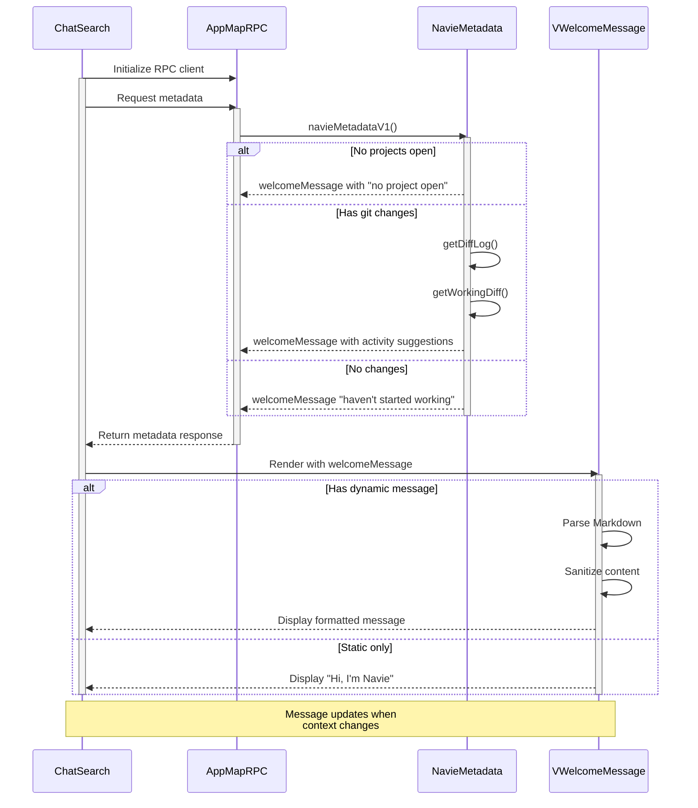

## Navie Chat Welcome Message

The welcome message is a dynamic greeting that appears when the user opens the Navie Chat window.
The message is based on the user's current workspace activity and the status of their projects.

This sequence diagram shows:

1. Initial loading:
   - ChatSearch initializes and creates RPC client
   - Requests metadata from the NavieMetadata service
2. Metadata processing:
   - NavieMetadata determines the appropriate message based on:
     - Whether projects are open
     - Git changes and working diff status
     - Current workspace activity
3. Message rendering:

   - VWelcomeMessage receives the content
   - Processes markdown if dynamic content exists
   - Sanitizes the content
   - Renders either dynamic or static message

4. The system maintains this state and updates when the context changes or new messages arrive
