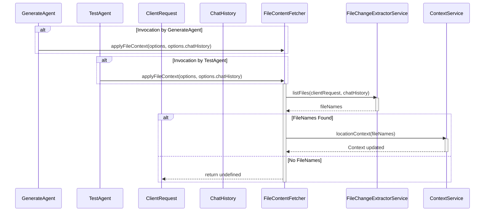
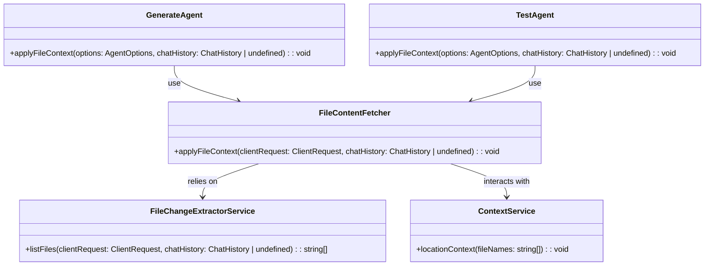

File content fetcher is used to detect the locations of files that are mentioned in the chat, and to
fetch the content of those files.

### Sequence Diagram

```mermaid
sequenceDiagram
    participant GenerateAgent as GenerateAgent
    participant TestAgent as TestAgent
    participant ClientRequest as ClientRequest
    participant ChatHistory as ChatHistory
    participant FileContentFetcher as FileContentFetcher
    participant FileChangeExtractorService as FileChangeExtractorService
    participant ContextService as ContextService

    alt Invocation by GenerateAgent
        GenerateAgent->>FileContentFetcher: applyFileContext(options, options.chatHistory)
    end

    alt Invocation by TestAgent
        TestAgent->>FileContentFetcher: applyFileContext(options, options.chatHistory)
    end

    activate FileContentFetcher
    FileContentFetcher->>FileChangeExtractorService: listFiles(clientRequest, chatHistory)
    activate FileChangeExtractorService
    FileChangeExtractorService-->>FileContentFetcher: fileNames
    deactivate FileChangeExtractorService

    alt FileNames Found
        FileContentFetcher->>ContextService: locationContext(fileNames)
        activate ContextService
        ContextService-->>FileContentFetcher: Context updated
        deactivate ContextService
    else No FileNames
        FileContentFetcher-->>ClientRequest: return undefined
    end

    deactivate FileContentFetcher
```

### Class Map

```mermaid
classDiagram
  class FileContentFetcher {
      +applyFileContext(clientRequest: ClientRequest, chatHistory: ChatHistory | undefined): void
  }

  class FileChangeExtractorService {
      +listFiles(clientRequest: ClientRequest, chatHistory: ChatHistory | undefined): string[]
  }

  class ContextService {
      +locationContext(fileNames: string[]): void
  }

  class GenerateAgent {
      +applyFileContext(options: AgentOptions, chatHistory: ChatHistory | undefined): void
  }

  class TestAgent {
      +applyFileContext(options: AgentOptions, chatHistory: ChatHistory | undefined): void
  }

  GenerateAgent --> FileContentFetcher : use
  TestAgent --> FileContentFetcher : use
  FileContentFetcher --> FileChangeExtractorService : relies on
  FileContentFetcher --> ContextService : interacts with
```
