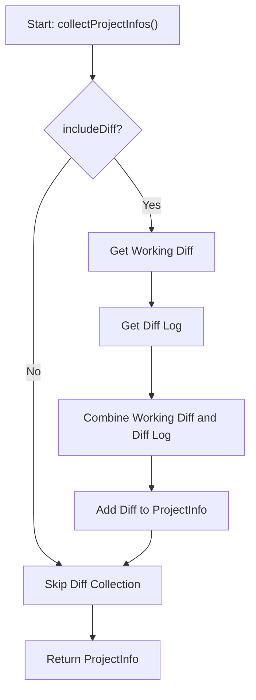
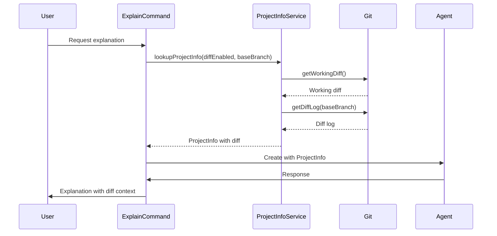
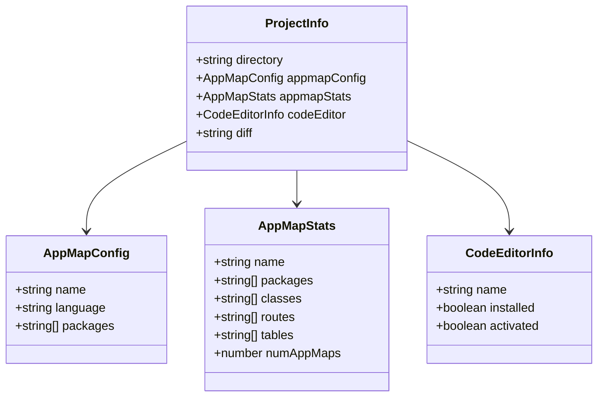
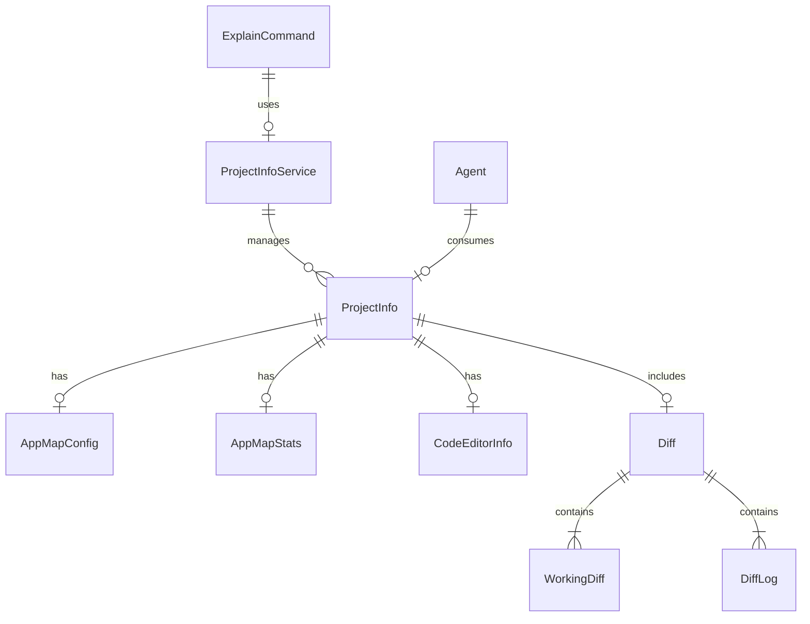

## Project Info - Diff Integration

1. Flowchart: Git Diff Process

This flowchart will illustrate the new process of obtaining and including diff information in the
project context.

2. Sequence Diagram: Diff Integration in Explain Command

This sequence diagram will show how the diff information flows through the system when processing an
explain command.

3. Class Diagram: Updated ProjectInfo Structure

This class diagram will show the changes to the ProjectInfo structure, highlighting the new diff
property.

4. Entity-Relationship Diagram: ProjectInfo and Related Entities

This ERD will show how the ProjectInfo relates to other entities in the system, including the new
diff information.

These diagrams provide a comprehensive overview of the recent changes, focusing on the addition of
diff functionality to the ProjectInfo and how it's integrated into the existing system. They cover
the process flow, data structure changes, and relationships between different components affected by
these changes.
