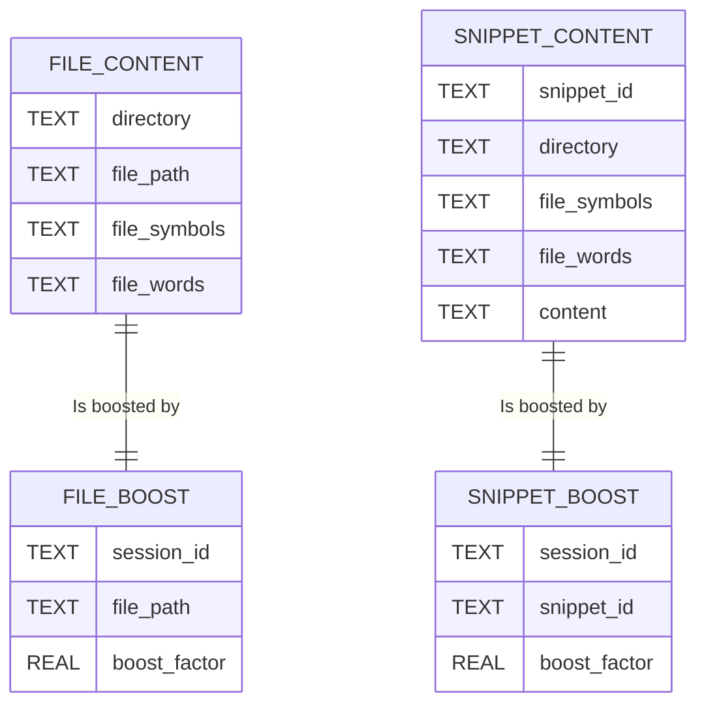

# `@appland/search`

## session_id

The `session id` parameter is an integral part of differentiating boost records in this system. Its
intent is to make sure that the boost factors, which affect search results, remain specific to a
particular search session and do not impact other concurrent search sessions.

### Intent

The main goal of introducing a `session id` is to:

1. **Isolate Boost Factors**: By associating each boost record with a unique session id, different
   sessions' boost factors are kept separate. This means that boosting done in one session doesn't
   unintentionally affect another.

2. **Maintain Contextual Relevance**: Boost factors should only influence the search results within
   the scope of their intended search session. This ensures the search system remains contextually
   aware and the results are relevant to the specific scenarios where the boosts were applied.

### How It Works for Concurrency

- **Storage**: When a boost factor is being stored in the system, it includes a `session id` in the
  database schema for boost records. This ties the boost factor directly to the user's session that
  triggered it.

- **Filtering**: When search operations are performed, only boost factors associated with the
  current session id are considered. This filtering ensures that only relevant boosts are applied to
  the search results.

- **Concurrent Use**: In environments where multiple users or sessions are interacting with the
  search system simultaneously, the session id ensures that one session's boost factors don't spill
  over and impact the results of another session. This isolation is crucial in multi-user systems
  where search personalization is required.

### Entity-Relationship Diagram

